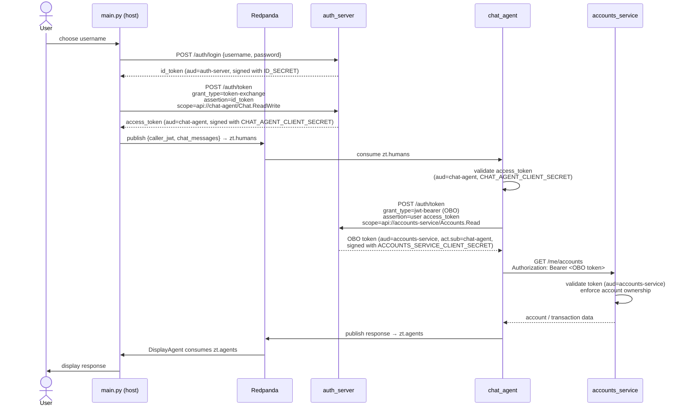

# Zero-Trust Agent Authentication (OBO Flow)

This example demonstrates zero-trust authentication between EggAI agents using OAuth2 token exchange and On-Behalf-Of (OBO) flows, mirroring the [Microsoft Identity Platform](https://learn.microsoft.com/en-us/entra/identity-platform/v2-oauth2-on-behalf-of-flow).

No service trusts any other service implicitly. Every call carries a scoped, signed access token. When an agent needs to call a downstream API on behalf of a user, it exchanges the user's token for a new one via the OBO flow.

## Authentication Flow

```
  Host (main.py)                              Docker Network
  ──────────────                              ──────────────

  1. POST /auth/login
     {username, password}  ────────────────►  auth_server
                           ◄────────────────  ← id_token (aud=auth_server, signed with ID_SECRET)

  2. POST /auth/token
     grant_type=token-exchange
     assertion=id_token
     client_id=chat-agent
     scope=api://chat-agent/Chat.ReadWrite
                           ────────────────►  auth_server
                           ◄────────────────  ← access_token (aud=chat-agent,
                                                signed with CHAT_AGENT_CLIENT_SECRET)

  3. Publish to Kafka      ────────────────►  Redpanda (zt.humans topic)
     {caller_jwt, chat_messages}

                                              chat_agent (subscribes to zt.humans)
                                              ─────────
                                              4. Validates access_token
                                                 using CHAT_AGENT_CLIENT_SECRET
                                                 checks aud=chat-agent

                                              5. POST /auth/token (OBO exchange)
                                                 grant_type=jwt-bearer
                                                 client_id=chat-agent
                                                 client_secret=CHAT_AGENT_CLIENT_SECRET
                                                 assertion=user's access_token
                                                 scope=api://accounts-service/Accounts.Read
                                                 requested_token_use=on_behalf_of
                                                                     ──────────►  auth_server
                                                                     ◄──────────  ← OBO access_token
                                                                                    (aud=accounts-service,
                                                                                     act.sub=chat-agent,
                                                                                     signed with ACCOUNTS_SERVICE_CLIENT_SECRET)

                                              6. GET /me/accounts  (or /me/accounts/{id}/transactions)
                                                 Authorization: Bearer <OBO token>
                                                                     ──────────►  accounts_service
                                                                                  Validates token using
                                                                                  ACCOUNTS_SERVICE_CLIENT_SECRET
                                                                                  checks aud=accounts-service
                                                                                  enforces account ownership
                                                                     ◄──────────  ← account / transaction data

                                              7. Publishes response  ──────────►  Redpanda (zt.agents topic)

  8. DisplayAgent receives response
     from zt.agents topic  ◄────────────────  Redpanda
```



## Token Signing Model

Each registered app has a `client_id` and `client_secret`. Access tokens targeting an app are signed with that app's `client_secret`:

| Token | Audience | Signed With | Validated By |
|-------|----------|-------------|--------------|
| id_token | `auth_server` | `ID_SECRET` | auth_server only |
| access_token for chat-agent | `chat-agent` | `CHAT_AGENT_CLIENT_SECRET` | chat_agent |
| OBO access_token for accounts-service | `accounts-service` | `ACCOUNTS_SERVICE_CLIENT_SECRET` | accounts_service |

This mirrors how the Microsoft Identity Platform works with RS256 (IdP signs with private key, apps validate with public key), adapted for HS256 where each app's secret serves as both the signing and validation key.

## Auth Server Endpoints

### POST /auth/login

Authenticates a user and returns an `id_token`.

- **Input:** `{username, password}`
- **Output:** `{id_token, token_type, expires_in}`
- **id_token claims:** `sub`, `name`, `email`, `aud=auth_server`

### POST /auth/token

Issues scoped access tokens. Supports two grant types:

**Token Exchange** (`grant_type=urn:ietf:params:oauth:grant-type:token-exchange`)

Pre-authorized exchange for public clients (e.g. the CLI). Exchanges an `id_token` for a scoped `access_token`. No `client_secret` required.

- **Input:** `assertion` (id_token), `client_id` (target app), `scope`
- **Output:** `{access_token, token_type, expires_in}`
- **access_token claims:** `sub`, `name`, `email`, `aud=<target_app>`, `scp`, `azp=cli`
- **Security:** the scope's audience must match `client_id`; a public client cannot mint tokens for any audience other than the one it explicitly identifies

**On-Behalf-Of** (`grant_type=urn:ietf:params:oauth:grant-type:jwt-bearer`)

Confidential client exchanges a user's access token for a new access token targeting a downstream API.

- **Input:** `client_id`, `client_secret`, `assertion` (user's access_token), `scope`, `requested_token_use=on_behalf_of`
- **Output:** `{access_token, token_type, expires_in}`
- **access_token claims:** `sub` (original user), `aud=<target_app>`, `azp=<calling_app>`, `act.sub=<calling_app>`, `scp`

## App Registry

Configured via environment variables, loaded at startup:

| App | Client ID | Allowed Scopes |
|-----|-----------|----------------|
| Chat Agent | `chat-agent` | `api://chat-agent/Chat.ReadWrite`, `api://accounts-service/Accounts.Read` |
| Accounts Service | `accounts-service` | `api://accounts-service/Accounts.Read` |

## Project Structure

```
zero_trust/
├── main.py                      # Host CLI: login, token exchange, chat UI
├── display_agent.py             # EggAI agent: subscribes to zt.agents, renders responses
├── shared.py                    # Kafka channel definitions (zt.agents, zt.humans)
├── jwt_utils.py                 # JWT validation helper with clock-skew leeway
├── lite_llm_agent.py            # LiteLLM agent wrapper with tool-calling loop and context injection
├── docker-compose.yml           # Full stack: Redpanda, auth_server, accounts_service, chat_agent
├── .env.example                 # Configuration template
├── requirements.txt             # Host-side Python dependencies
├── auth_server/
│   ├── main.py                  # FastAPI identity provider (login + token exchange + OBO)
│   ├── Dockerfile
│   └── requirements.txt
├── chat_agent/
│   ├── main.py                  # EggAI agent: validates JWT, runs LLM, publishes response
│   ├── agent.py                 # LiteLLM agent with get_accounts / get_transactions tools + OBO exchange
│   ├── Dockerfile
│   └── requirements.txt
└── accounts_service/
    ├── main.py                  # FastAPI resource server: in-memory SQLite, validates OBO tokens, enforces account ownership
    ├── Dockerfile
    └── requirements.txt
```

## Demo Data

The accounts service is seeded with in-memory SQLite data on startup:

| User | Account ID | Account Name |
|------|-----------|--------------|
| alice | ACC-001 | Current Account |
| alice | ACC-002 | Savings |
| alice | ACC-003 | Cash ISA |
| bob | ACC-004 | Current Account |
| bob | ACC-005 | Savings |

Each account has sample transactions across categories (groceries, food & drink, transport, shopping, etc.). The service enforces ownership — a token for `alice` cannot access Bob's accounts, regardless of what account ID the LLM supplies.

## Environment Variables

```env
# Auth server signing secret for id_tokens
ID_SECRET=<min 32 chars>

# App registration: Chat Agent
CHAT_AGENT_CLIENT_ID=chat-agent
CHAT_AGENT_CLIENT_SECRET=<min 32 chars>

# App registration: Accounts Service
ACCOUNTS_SERVICE_CLIENT_ID=accounts-service
ACCOUNTS_SERVICE_CLIENT_SECRET=<min 32 chars>

# LLM provider (choose one)
OPENAI_API_KEY=sk-...
CHAT_AGENT_MODEL=openai/gpt-4o-mini

# or
ANTHROPIC_API_KEY=sk-ant-...
CHAT_AGENT_MODEL=claude-3-haiku-20240307
```

## Running the Demo

```bash
cd zero_trust
cp .env.example .env   # Fill in secrets and LLM API key
docker compose up -d   # Start Redpanda, auth_server, accounts_service, chat_agent
pip install -r requirements.txt
python main.py
```

Log in as `alice` or `bob` (press Enter to default to alice), then ask questions like:

- "What accounts do I have?"
- "Show me my recent transactions"
- "How much did I spend on groceries last month?"
- "Which account has the most activity?"

The agent will call `get_accounts` to discover the user's accounts, then `get_transactions` for the relevant account — each call performing a full OBO token exchange behind the scenes.

## Production Considerations

This demo uses HS256 (symmetric) signing for simplicity. In production:

- **Use RS256 (asymmetric):** The IdP signs tokens with a private key; services validate with the public key. No shared secrets needed.
- **Replace the custom auth_server** with your organization's IdP (Azure AD, Keycloak, Auth0, Okta, etc.). The token exchange and OBO grant types used here are standard OAuth2 extensions (RFC 8693, RFC 7523) supported by all major identity platforms.
- **Add token caching and refresh** to avoid exchanging tokens on every request.
- **Use HTTPS** for all service-to-service communication.
